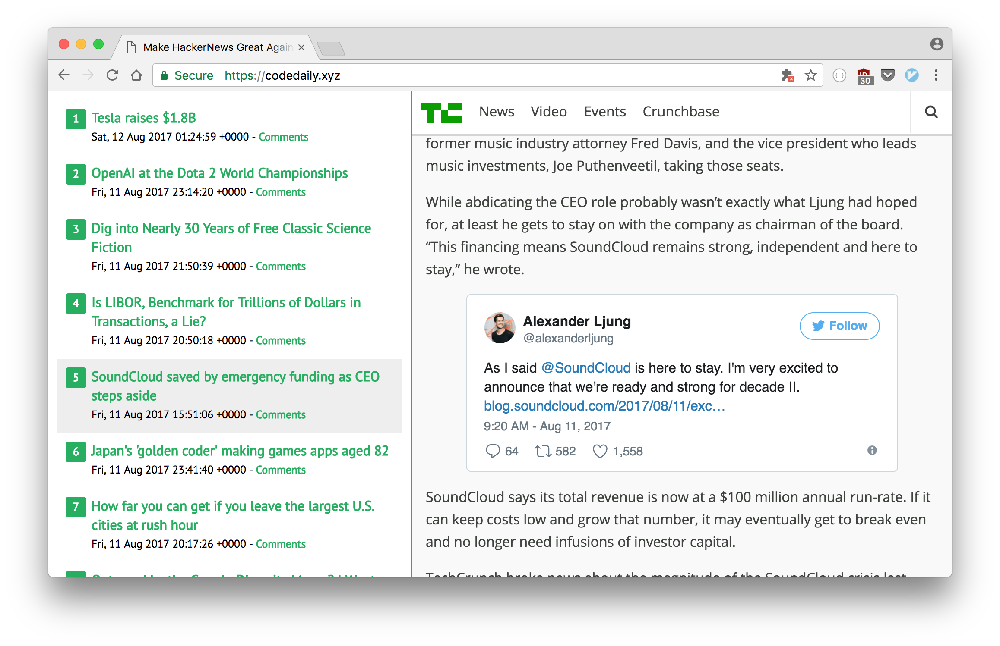

# HackerNews RSS Reader

Yet another HackerNews client. Live demo https://codedaily.xyz



Requirements
- Rust Nightly

## Installation

Make sure you're using Rust nightly:

```
rustup default nightly
```

Run the web UI:

```
ROCKET_PORT=1234 ROCKET_ENV=prod cargo run
```

## TODO

- Fix `preview` API to be able to load image/css/js files from remote URL
- Resizeable newsfeed
- View HN comments in preview mode
- Format post's time